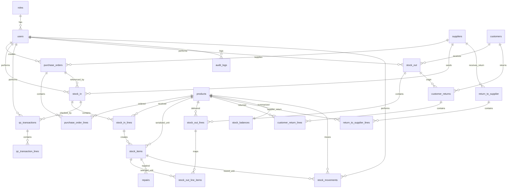

# Stock Inventory Operations System — Data Model v1

## 1. Core modeling approach

This model is designed around these rules:

1. Use a **header + detail pattern** for business transactions.
    - Example: `purchase_orders` + `purchase_order_lines`
    - Example: `stock_in` + `stock_in_lines`
2. Use **unit-level tracking** for serialized products.
3. Use a **stock balance summary table** for fast inventory lookup.
4. Use a **central stock movement ledger** for end-to-end traceability.

---

## 2. Main entities

## A. Security and administration

### `roles`

- `id` PK
- `code` unique (`ADMIN`, `STAFF`)
- `name`
- `description`

### `users`

- `id` PK
- `role_id` FK -> `roles.id`
- `full_name`
- `email` unique
- `username` unique
- `password_hash`
- `status` (`ACTIVE`, `INACTIVE`)
- `created_at`
- `updated_at`

---

## B. Master data

### `products`

- `id` PK
- `product_code` unique
- `product_name`
- `product_type` (`DEVICE`, `ACCESSORY`, `CONSUMABLE`)
- `selling_price`
- `uom`
- `reorder_level`
- `remarks`
- `status` (`ACTIVE`, `INACTIVE`)
- `created_by` FK -> `users.id`
- `created_at`
- `updated_at`

### `suppliers`

- `id` PK
- `supplier_code` unique
- `supplier_name`
- `contact_person`
- `phone`
- `email`
- `address`
- `status`
- `remarks`
- `created_at`
- `updated_at`

### `customers`

- `id` PK
- `customer_name`
- `contact_person`
- `phone`
- `email`
- `address`
- `status`
- `remarks`
- `created_at`
- `updated_at`

---

## C. Purchase order

### `purchase_orders`

- `id` PK
- `po_number` unique
- `po_date`
- `supplier_id` FK -> `suppliers.id`
- `expected_delivery_date`
- `status` (`DRAFT`, `ISSUED`, `COMPLETED`, `CANCELLED`)
- `created_by` FK -> `users.id`
- `remarks`
- `created_at`
- `updated_at`

### `purchase_order_lines`

- `id` PK
- `purchase_order_id` FK -> `purchase_orders.id`
- `product_id` FK -> `products.id`
- `ordered_qty`
- `unit_price`
- `subtotal`
- `remarks`

---

## D. Stock receiving

### `stock_in`

- `id` PK
- `stock_in_number` unique
- `stock_in_date`
- `purchase_order_id` nullable FK -> `purchase_orders.id`
- `supplier_id` FK -> `suppliers.id`
- `stock_in_pic_id` FK -> `users.id`
- `qc_person_id` nullable FK -> `users.id`
- `status` (`DRAFT`, `POSTED`, `CANCELLED`)
- `remarks`
- `created_at`
- `updated_at`

### `stock_in_lines`

- `id` PK
- `stock_in_id` FK -> `stock_in.id`
- `product_id` FK -> `products.id`
- `received_qty`
- `condition_at_receiving`
- `remarks`

---

## E. Serialized unit records

### `stock_items`

Use this table only for **devices** and **accessories**.

- `id` PK
- `product_id` FK -> `products.id`
- `stock_in_line_id` FK -> `stock_in_lines.id`
- `serial_number` unique
- `serial_source` (`FACTORY`, `GENERATED`)
- `current_status` (`RECEIVED`, `IN_STOCK`, `DELIVERED`, `UNDER_REPAIR`, `RETURNED_TO_SUPPLIER`, `RETURNED`)
- `is_available` boolean
- `last_movement_at`
- `remarks`

---

## F. Stock balances

### `stock_balances`

Fast summary table by product.

- `id` PK
- `product_id` unique FK -> `products.id`
- `qty_received_pending_qc`
- `qty_in_stock`
- `qty_delivered`
- `qty_under_repair`
- `qty_returned`
- `qty_returned_to_supplier`
- `updated_at`

---

## G. QC

### `qc_transactions`

- `id` PK
- `qc_reference_number` unique
- `stock_in_id` FK -> `stock_in.id`
- `qc_date`
- `qc_by` FK -> `users.id`
- `status` (`DRAFT`, `POSTED`, `CANCELLED`)
- `remarks`
- `created_at`

### `qc_transaction_lines`

- `id` PK
- `qc_transaction_id` FK -> `qc_transactions.id`
- `stock_in_line_id` FK -> `stock_in_lines.id`
- `product_id` FK -> `products.id`
- `stock_item_id` nullable FK -> `stock_items.id`
- `qc_result` (`PASS`, `FAIL`)
- `qty_pass`
- `qty_fail`
- `remarks`

---

## H. Stock out

### `stock_out`

- `id` PK
- `stock_out_number` unique
- `stock_out_date`
- `customer_id` FK -> `customers.id`
- `invoice_number`
- `pic_id` FK -> `users.id`
- `pick_list_reference` nullable
- `packing_verified` boolean
- `status` (`DRAFT`, `POSTED`, `CANCELLED`)
- `remarks`
- `created_at`

### `stock_out_lines`

- `id` PK
- `stock_out_id` FK -> `stock_out.id`
- `product_id` FK -> `products.id`
- `qty`
- `remarks`

### `stock_out_line_items`

Bridge table for serialized units.

- `id` PK
- `stock_out_line_id` FK -> `stock_out_lines.id`
- `stock_item_id` FK -> `stock_items.id`

---

## I. Repair

### `repairs`

- `id` PK
- `repair_transaction_number` unique
- `repair_date`
- `stock_item_id` FK -> `stock_items.id`
- `customer_id` nullable FK -> `customers.id`
- `issue_description`
- `repair_status` (`OPEN`, `IN_PROGRESS`, `COMPLETED`, `CANCELLED`)
- `remarks`
- `created_by` FK -> `users.id`
- `created_at`
- `updated_at`

### `repair_updates` _(optional)_

- `id` PK
- `repair_id` FK -> `repairs.id`
- `status`
- `notes`
- `updated_by`
- `updated_at`

---

## J. Return to supplier

### `return_to_supplier`

- `id` PK
- `rts_transaction_number` unique
- `supplier_id` FK -> `suppliers.id`
- `stock_in_id` nullable FK -> `stock_in.id`
- `return_date`
- `status` (`DRAFT`, `POSTED`, `CANCELLED`)
- `remarks`
- `created_by` FK -> `users.id`
- `created_at`

### `return_to_supplier_lines`

- `id` PK
- `return_to_supplier_id` FK -> `return_to_supplier.id`
- `product_id` FK -> `products.id`
- `stock_item_id` nullable FK -> `stock_items.id`
- `qty`
- `reason_for_return`
- `remarks`

---

## K. Customer returns

### `customer_returns`

- `id` PK
- `return_transaction_number` unique
- `return_date`
- `customer_id` FK -> `customers.id`
- `original_invoice_number`
- `original_stock_out_id` FK -> `stock_out.id`
- `status` (`DRAFT`, `POSTED`, `CANCELLED`)
- `remarks`
- `created_by` FK -> `users.id`
- `created_at`

### `customer_return_lines`

- `id` PK
- `customer_return_id` FK -> `customer_returns.id`
- `original_stock_out_line_id` nullable FK -> `stock_out_lines.id`
- `product_id` FK -> `products.id`
- `stock_item_id` nullable FK -> `stock_items.id`
- `qty`
- `reason_for_return`
- `condition_on_return`
- `next_action` nullable
- `remarks`

---

## L. Central stock movement ledger

### `stock_movements`

This is the core traceability table.

- `id` PK
- `movement_datetime`
- `product_id` FK -> `products.id`
- `stock_item_id` nullable FK -> `stock_items.id`
- `movement_type` (`STOCK_IN`, `QC_PASS`, `QC_FAIL`, `STOCK_OUT`, `REPAIR_IN`, `REPAIR_OUT`, `CUSTOMER_RETURN`, `RETURN_TO_SUPPLIER`, `ADJUSTMENT`)
- `reference_table`
- `reference_id`
- `qty_in`
- `qty_out`
- `from_status` nullable
- `to_status` nullable
- `performed_by` FK -> `users.id`
- `remarks`

---

## M. Audit logs

### `audit_logs`

- `id` PK
- `user_id` FK -> `users.id`
- `module_name`
- `entity_name`
- `entity_id`
- `action` (`CREATE`, `UPDATE`, `DELETE`, `POST`, `CANCEL`, `LOGIN`, `EXPORT`)
- `old_values` JSON
- `new_values` JSON
- `created_at`

---

## 3. Relationship summary

- `suppliers` -> `purchase_orders`
- `purchase_orders` -> `purchase_order_lines`
- `purchase_orders` -> `stock_in`
- `stock_in` -> `stock_in_lines`
- `stock_in_lines` -> `stock_items` for serialized products
- `stock_in` -> `qc_transactions`
- `qc_transactions` -> `qc_transaction_lines`
- `customers` -> `stock_out`
- `stock_out` -> `stock_out_lines`
- `stock_out_lines` -> `stock_out_line_items` -> `stock_items`
- `stock_items` -> `repairs`
- `stock_items` -> `return_to_supplier_lines`
- `stock_out` -> `customer_returns`
- every module writes to `stock_movements`
- every important action writes to `audit_logs`

---

## 4. Mermaid ERD

---

## 5. Critical business constraints

### Product rules

- `DEVICE` -> must have serial number
- `ACCESSORY` -> generated internal serial number
- `CONSUMABLE` -> no serial row in `stock_items`

### Serial rules

- `serial_number` must be unique
- generated format can be: `[PRODUCTCODE]-[YYYYMMDD]-[RUNNING_NO]`

### Transaction rules

- stock cannot go negative
- posted transactions should not be deleted
- use cancellation instead of hard delete
- every posted transaction inserts records into `stock_movements`
- every important change inserts records into `audit_logs`

### Return rules

- customer return must reference an existing delivered stock-out
- return-to-supplier can only reference received or failed items

### Status transitions

- stock in -> `RECEIVED`
- QC pass -> `IN_STOCK`
- stock out -> `DELIVERED`
- repair -> `UNDER_REPAIR`
- supplier return -> `RETURNED_TO_SUPPLIER`
- customer return -> `RETURNED`

---

## 6. Recommended enums

Use enums or lookup tables for:

- `product_type`
- `user_status`
- `transaction_status`
- `item_status`
- `qc_result`
- `repair_status`
- `movement_type`
- `audit_action`

---

## 7. Recommended MVP scope

### Phase 1

- `roles`
- `users`
- `products`
- `suppliers`
- `customers`
- `purchase_orders`
- `purchase_order_lines`
- `stock_in`
- `stock_in_lines`
- `stock_items`
- `qc_transactions`
- `qc_transaction_lines`
- `stock_out`
- `stock_out_lines`
- `stock_out_line_items`
- `stock_balances`
- `stock_movements`
- `audit_logs`

### Phase 2

- `repairs`
- `return_to_supplier`
- `return_to_supplier_lines`
- `customer_returns`
- `customer_return_lines`

---

## 8. Suggested next conversion

Best next outputs from this model:

1. Exact ERD with PK/FK notation
2. PostgreSQL SQL DDL
3. Laravel migration structure
4. Prisma schema
5. Backend API-ready model list
