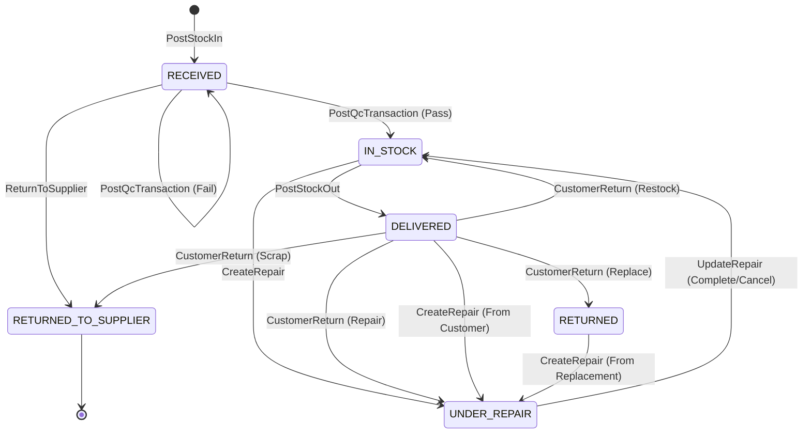

# The Ultimate Stock Movement & Status Matrix

This comprehensive matrix details **every single possible operation** affecting stock and inventory within the SIO backend application. 
It exhaustively documents the relationship between the master operational transactions, the finite states of physical items (`StockItemStatus`), their immediate availability flags, and the exact ledger variables recorded in the `StockMovement` table.

## Master Lifecycle Flow (Serialized Items)

---

## 1. Primary Inbound & Outbound Operations (The Happy Flow)

These operations handle the standard movement of buying from a supplier and selling to a customer.

| Operation / Action | Backing Use Case | Transaction Status Created/Updated | Initial `StockItem` State (Status / Available) | Final `StockItem` State (Status / Available) | `MovementType` Triggered | `qty_in` | `qty_out` |
| :--- | :--- | :--- | :--- | :--- | :--- | :--- | :--- |
| **Receive Purchase Order** | `PostStockInUseCase` | `StockInStatus::Received` | *(New Item)* | `RECEIVED` / `true` | `STOCK_IN` | X | 0 |
| **QC Assessment (Pass)** | `PostQcTransactionUseCase` | `QcTransactionStatus::Posted` | `RECEIVED` / `true` | `IN_STOCK` / `true` | `QC_PASS` | 1 | 0 |
| **QC Assessment (Fail)** | `PostQcTransactionUseCase` | `QcTransactionStatus::Posted` | `RECEIVED` / `true` | `RECEIVED` / `false` | `QC_FAIL` | 0 | 1 |
| **Deliver to Customer** | `PostStockOutUseCase` | `StockOutStatus::Posted` | `IN_STOCK` / `true` | `DELIVERED` / `false` | `STOCK_OUT` | 0 | X |

*(Note: X implies aggregate quantity behavior for non-serialized items. For serialized items, X is always strictly 1 per `StockItem` row).*

---

## 2. Exceptions & Returns Management

Operations triggered when items are defective, cancelled, or returned. 

| Operation / Action | Backing Use Case | Transaction Status Created/Updated | Initial `StockItem` State (Status / Available) | Final `StockItem` State (Status / Available) | `MovementType` Triggered | `qty_in` | `qty_out` |
| :--- | :--- | :--- | :--- | :--- | :--- | :--- | :--- |
| **Customer Return (Restock)** | `CreateCustomerReturnUseCase` | `ExceptionTransactionStatus::Posted` | `DELIVERED` / `false` | `IN_STOCK` / `true` | `CUSTOMER_RETURN` | X | 0 |
| **Customer Return (Repair)** | `CreateCustomerReturnUseCase` | `ExceptionTransactionStatus::Posted` | `DELIVERED` / `false` | `UNDER_REPAIR` / `false` | `CUSTOMER_RETURN` | X | 0 |
| **Customer Return (Replace)** | `CreateCustomerReturnUseCase` | `ExceptionTransactionStatus::Posted` | `DELIVERED` / `false` | `RETURNED` / `false` | `CUSTOMER_RETURN` | X | 0 |
| **Customer Return (Scrap)** | `CreateCustomerReturnUseCase` | `ExceptionTransactionStatus::Posted` | `DELIVERED` / `false` | `RETURNED_TO_SUPPLIER` / `false` | `CUSTOMER_RETURN` | X | 0 |
| **Return to Supplier (RTS)** | `CreateReturnToSupplierUseCase`| `ExceptionTransactionStatus::Posted` | `RECEIVED` / *any*| `RETURNED_TO_SUPPLIER` / `false` | `RETURN_TO_SUPPLIER` | 0 | X |

> [!CAUTION]
> As highlighted in my earlier analysis, using `qty_in = X` universally for all Customer Return branches breaks non-serialized balance checks, since non-serialized goods don't have an `is_available` flag. This creates a data inconsistency where scrapped batteries are counted as immediately sellable stock.

---

## 3. The Repair Pipeline

This ecosystem tracks repairing goods—either from internal testing or goods shipped back from customers.

| Operation / Action | Backing Use Case | Incident Status Created/Updated | Initial `StockItem` State (Status / Available) | Final `StockItem` State (Status / Available) | `MovementType` Triggered | `qty_in` | `qty_out` |
| :--- | :--- | :--- | :--- | :--- | :--- | :--- | :--- |
| **Initiate Repair** | `CreateRepairUseCase` | `RepairStatus::Open` | `IN_STOCK` or `DELIVERED` or `RETURNED` | `UNDER_REPAIR` / `false` | `REPAIR_IN` | 0 | 1 |
| **Update Progress** | `UpdateRepairStatusUseCase` | `RepairStatus::InProgress` | `UNDER_REPAIR` / `false` | *(Unchanged)* | *None* | 0 | 0 |
| **Complete Repair** | `UpdateRepairStatusUseCase` | `RepairStatus::Completed` | `UNDER_REPAIR` / `false` | `IN_STOCK` / `true` | `REPAIR_OUT` | 1 | 0 |
| **Cancel Repair (Unrepairable)** | `UpdateRepairStatusUseCase` | `RepairStatus::Cancelled` | `UNDER_REPAIR` / `false` | `IN_STOCK` / `false` | `REPAIR_CANCELLED`| 0 | 0 |

> [!WARNING]
> Notice the asymmetric quantity math inside the Repair Pipeline. Initiating a repair deducts stock (`qty_out = 1`). Completing it adds stock back (`qty_in = 1`). However, Cancelling a repair logs `qty_in = 0, qty_out = 0`, permanently deleting 1 stock count from existence. Furthermore, it forces an unrepairable item's status mathematically back to `IN_STOCK` inside the database, causing logic confusion.

---

## Technical Appendix: Enums Referenced

If you are modifying these core systems, here are all the possible internal variable states expected by the backend engine:

**`MovementType` Enums**: `STOCK_IN`, `QC_PASS`, `QC_FAIL`, `STOCK_OUT`, `REPAIR_IN`, `REPAIR_OUT`, `REPAIR_CANCELLED`, `CUSTOMER_RETURN`, `CUSTOMER_RETURN_CANCELLED`, `RETURN_TO_SUPPLIER`, `RETURN_TO_SUPPLIER_CANCELLED`, `ADJUSTMENT`.

**`StockItemStatus` Enums (Physical Serialized Asset Status)**: `RECEIVED`, `IN_STOCK`, `DELIVERED`, `UNDER_REPAIR`, `RETURNED_TO_SUPPLIER`, `RETURNED`.

**Master Transaction Status Enums**
- `PurchaseOrderStatus`: `Draft`, `Issued`, `Completed`, `Cancelled`
- `StockInStatus`: `Draft`, `Posted`, `Received`, `Cancelled`
- `QcTransactionStatus`: `Draft`, `Posted`, `Cancelled`
- `StockOutStatus`: `Draft`, `Posted`, `Cancelled`
- `ExceptionTransactionStatus` (Used for Returns / RTS): `Draft`, `Posted`, `Cancelled`
- `RepairStatus`: `Open`, `InProgress`, `Completed`, `Cancelled`
